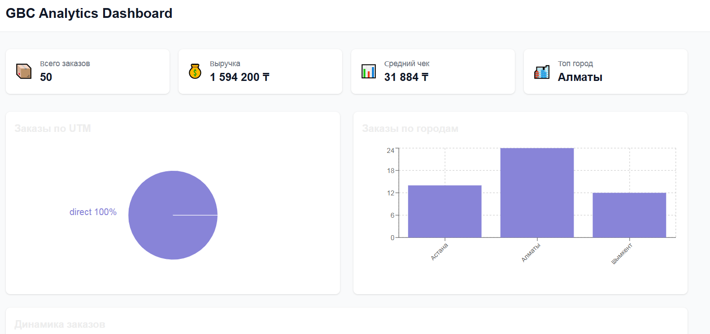
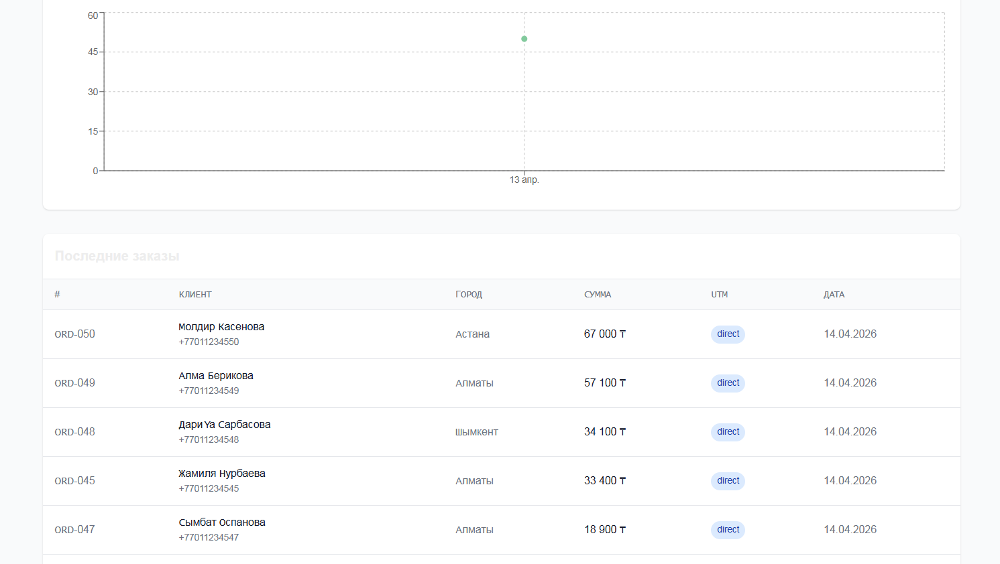
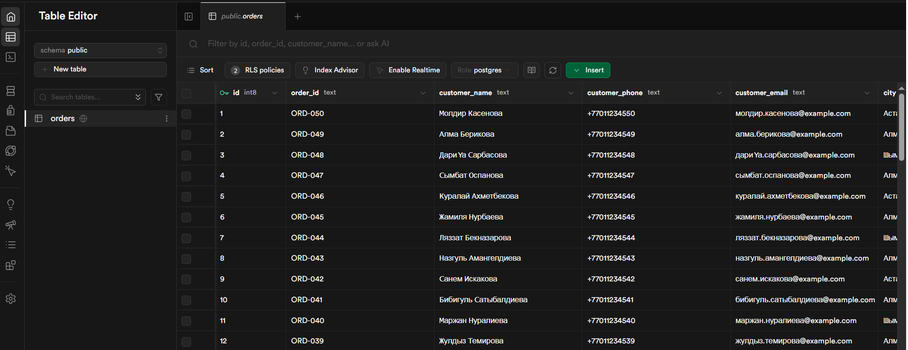
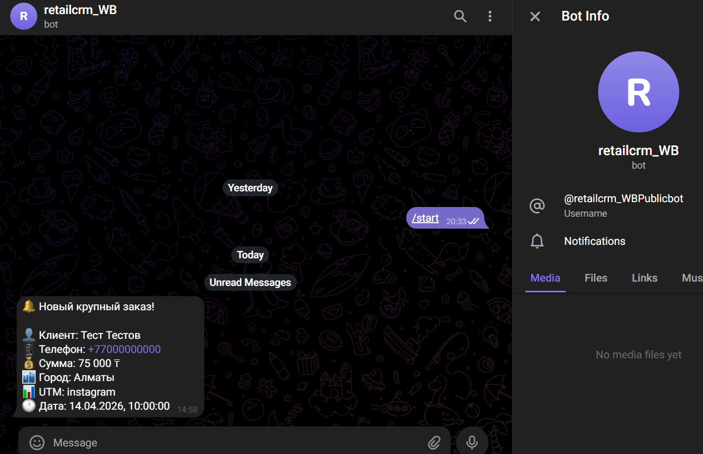

# GBC Analytics Dashboard

Аналитическая система для отслеживания заказов корректирующего белья с дашбордом, базой данных Supabase и Telegram-уведомлениями.



## Архитектура

```
mock_orders.json → RetailCRM API → Scripts → Supabase → Dashboard (Vercel) → Telegram Bot
```

## Технологии

- **Frontend**: Next.js 14, Tailwind CSS, Recharts
- **Backend**: Node.js скрипты (load-orders, sync-orders)
- **База данных**: Supabase (PostgreSQL)
- **CRM**: RetailCRM API
- **Мессенджер**: Telegram Bot API

## Возможности

- 📊 Дашборд с графиками (UTM-источники, города, динамика заказов)
- 📈 Статистика: всего заказов, выручка, средний чек, топ-город
- 🔔 Telegram-уведомления при заказе > 50,000 ₸
- 📱 Адаптивная мобильная верстка
- 🔄 Синхронизация заказов из RetailCRM в Supabase

## Скриншоты

### Dashboard - Статистика и графики


### Dashboard - Таблица заказов



### Supabase - База данных



### Telegram - Уведомления



## Установка

```bash
npm install
```

## Настройка переменных окружения

Создайте `.env.local`:

```env
NEXT_PUBLIC_SUPABASE_URL=https://your-project.supabase.co
NEXT_PUBLIC_SUPABASE_PUBLISHABLE_KEY=your-publishable-key
SUPABASE_SERVICE_KEY=your-service-role-key
RETAILCRM_API_KEY=your-retailcrm-api-key
TELEGRAM_BOT_TOKEN=your-telegram-bot-token
TELEGRAM_CHAT_ID=your-chat-id
ORDER_ALERT_THRESHOLD=50000
```

## Скрипты

### Загрузка заказов в RetailCRM

```bash
npm run load-orders
```

### Синхронизация заказов в Supabase

```bash
npm run sync-orders
```

## Supabase Database

Выполните SQL из `supabase_migration.sql` в Supabase SQL Editor:

```sql
CREATE TABLE orders (
  id BIGINT GENERATED BY DEFAULT AS IDENTITY PRIMARY KEY,
  order_id TEXT NOT NULL UNIQUE,
  customer_name TEXT,
  customer_phone TEXT,
  customer_email TEXT,
  city TEXT NOT NULL,
  total_amount NUMERIC(12, 2) NOT NULL DEFAULT 0,
  utm_source TEXT,
  status TEXT NOT NULL DEFAULT 'new',
  created_at TIMESTAMPTZ NOT NULL,
  raw_data JSONB,
  synced_at TIMESTAMPTZ DEFAULT NOW()
);

CREATE INDEX idx_orders_created_at ON orders (created_at);
CREATE INDEX idx_orders_utm_source ON orders (utm_source);
CREATE INDEX idx_orders_city ON orders (city);

ALTER TABLE orders ENABLE ROW LEVEL SECURITY;
CREATE POLICY "Allow public read" ON orders FOR SELECT USING (true);
```

## Деплой

### Vercel

1. Подключите GitHub-репозиторий к Vercel
2. Добавьте переменные окружения
3. Деплой произойдёт автоматически

### Env-переменные для Vercel

- `NEXT_PUBLIC_SUPABASE_URL`
- `NEXT_PUBLIC_SUPABASE_PUBLISHABLE_KEY`
- `SUPABASE_SERVICE_KEY`
- `RETAILCRM_API_KEY`
- `TELEGRAM_BOT_TOKEN`
- `TELEGRAM_CHAT_ID`
- `ORDER_ALERT_THRESHOLD`

## Пример данных

50 тестовых заказов из `mock_orders.json`:
- Корректирующее бельё (Nova Classic, Nova Slim, Nova Body, Nova Lift)
- Доставка: Алматы, Астана, Шымкент
- UTM-источники: Instagram, Google, TikTok, Direct, Referral

## Live Demo

- Дашборд: https://testovoe-self.vercel.app
- RetailCRM: https://kiberars.retailcrm.ru
- Supabase: https://supabase.com/dashboard/project/lmbwhoqmgrouoywxvilh

## Telegram Bot

Бот отправляет уведомление при создании заказа на сумму > 50,000 ₸:

```
🔔 Новый крупный заказ!

👤 Клиент: Иван Иванов
📱 Телефон: +77000000000
💰 Сумма: 75,000 ₸
🏙️ Город: Алматы
📊 UTM: instagram
🕐 Дата: 14.04.2026
```

## История разработки

### Планирование и анализ предметной области

Перед началом разработки был проведён анализ требований:
- 5-этапный процесс: Account Setup → Load orders → Sync → Dashboard → Telegram bot
- Выбор стека: Next.js 14 + Tailwind + Supabase + RetailCRM API +grammy
- Готовый набор данных: 50 заказов корректирующего белья для Казахстана

### Технические промпты

1. **Создание проекта и выгрузка на GitHub**
   - Инициализация Next.js 14 с нуля
   - Настройка TailwindCSS, Supabase, Telegram Bot
   - Deploy на Vercel через CLI

2. **Добавление Tailwind CSS и мобильной верстки**
   - Конфигурация TailwindCSS
   - Адаптивная сетка: `grid-cols-1 sm:grid-cols-2 lg:grid-cols-4`

3. **Vercel и получение данных**
   - Деплой через vercel CLI
   - Web fetch mock_orders.json из внешнего репозитория

4. **Настройка Vercel проекта**
   - Подключение GitHub репозитория
   - Конфигурация environment variables

5. **Подтверждение плана** - Финальное утверждение

### Проблемы и решения

### Технические проблемы и решения

#### 1. GitHub API authentication
**Проблема:** Токен не прошёл валидацию при push
```
remote: Invalid username or password
```
**Решение:** Использование Personal Access Token с правами `repo`

#### 2. RetailCRM API endpoint
**Проблема:** Ошибка DNS/привязки - домен не существует
```
{"errorMsg":"Account does not exist.","success":false}
```
**Решение:** Корректировка baseURL: `gbc-market.retailcrm.ru` → `kiberars.retailcrm.ru`

#### 3. RetailCRM API authentication scheme
**Проблема:** Неверный способ передачи apiKey - использовался HTTP header вместо query string
```
{"errorMsg":"\"apiKey\" is missing.","success":false}
```
**Решение:** Передача через `url.searchParams.set("apiKey", ...)` вместо `headers`

#### 4. RetailCRM order validation
**Проблема:** Reference values не найдены в справочниках CRM
```
"errors":{"orderType":"\"OrderType\" with \"code\"=\"eshop-individual\" does not exist."}
```
**Решение:** Минимизация payload - удаление полей со справочными значениями

#### 5. Vercel routing
**Проблема:** Deployment не привязан к репозиторию с кодом
```
GET https://project-nukyc.vercel.app/ 404 (Not Found)
```
**Решение:** Пересоздание vercel link с привязкой к `Kiberars/retailcrm_WB`

#### 6. Environment variables bundling
**Проблема:** NEXT_PUBLIC_ переменные не попали в client bundle
```
@supabase/ssr: Your project's URL and API key are required
```
**Решение:** Добавление fallback значений в createBrowserClient

#### 7. Edge runtime compatibility
**Проблема:** Статический импорт пакета grammy не работает в Serverless функции
```
Error: Cannot find package 'grammy'
```
**Решение:** Динамический импорт: `const { Bot } = await import("grammy")`

### Результат

- ✅ 50 заказов загружены в RetailCRM
- ✅ 50 заказов синхронизированы в Supabase  
- ✅ Дашборд: https://testovoe-self.vercel.app
- ✅ Telegram бот: уведомления при заказе > 50,000 ₸
- ✅ README с документацией

## Лицензия

MIT